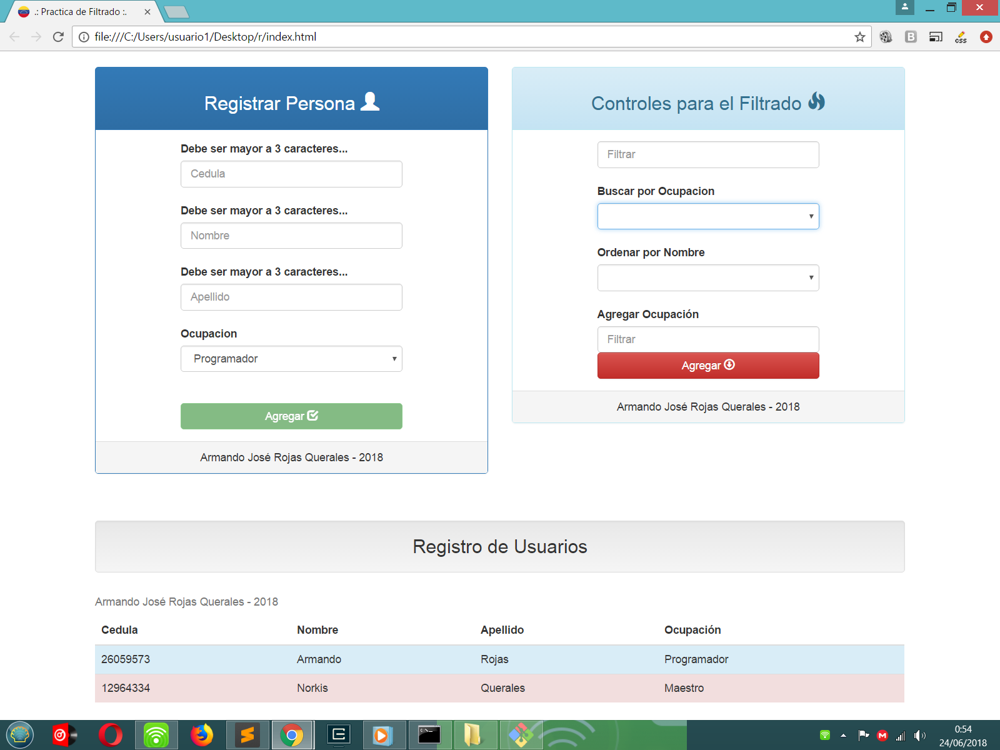

<a id="readme-top"></a>

<!-- PROJECT SHIELDS -->
[![Contributors][contributors-shield]][contributors-url]
[![Forks][forks-shield]][forks-url]
[![Stargazers][stars-shield]][stars-url]
[![Issues][issues-shield]][issues-url]
[![MIT License][license-shield]][license-url]
[![LinkedIn][linkedin-shield]][linkedin-url]

<!-- PROJECT LOGO -->
<br />
<div align="center">
  <a href="https://github.com/rojasarmando/User-Registry-SPA">
    
  </a>

  <h3 align="center">User Registry SPA</h3>

  <p align="center">
    AngularJS Single Page Application for user management with localStorage
    <br />
    <a href="#about-the-project"><strong>Explore the project »</strong></a>
    <br />
    <br />
    <a href="#demo">View Demo</a>
    ·
    <a href="https://github.com/rojasarmando/User-Registry-SPA/issues">Report Bug</a>
    ·
    <a href="https://github.com/rojasarmando/User-Registry-SPA/issues">Request Feature</a>
  </p>
</div>

<!-- LANGUAGE SELECTOR -->
<div align="center">
  <a href="#english-version">🇺🇸 English</a> | 
  <a href="#versión-en-español"> 🇻🇪 Español</a>
</div>

<!-- TABLE OF CONTENTS -->
<details>
  <summary>Table of Contents / Tabla de Contenido</summary>
  <ol>
    <li>
      <a href="#english-version">English Version</a>
      <ul>
        <li><a href="#about-the-project">About The Project</a></li>
        <li><a href="#built-with">Built With</a></li>
        <li><a href="#getting-started">Getting Started</a></li>
        <li><a href="#features">Features</a></li>
      </ul>
    </li>
    <li>
      <a href="#versión-en-español">Versión en Español</a>
      <ul>
        <li><a href="#acerca-del-proyecto">Acerca del Proyecto</a></li>
        <li><a href="#tecnologías">Tecnologías</a></li>
        <li><a href="#comenzando">Comenzando</a></li>
        <li><a href="#características">Características</a></li>
      </ul>
    </li>
    <li><a href="#contact">Contact / Contacto</a></li>
    <li><a href="#license">License / Licencia</a></li>
  </ol>
</details>

<!-- ENGLISH VERSION -->
<div id="english-version"></div>

## About The Project

[![Product Screenshot][product-screenshot]](https://github.com/rojasarmando/User-Registry-SPA)

A lightweight AngularJS Single Page Application that demonstrates user registration and management with localStorage persistence. This project was developed as a practice exercise to showcase fundamental AngularJS concepts.

Key advantages:
* No backend required - works entirely client-side
* Simple setup - just open the HTML file
* Clean, responsive interface
* Practical example of localStorage usage

<p align="right">(<a href="#readme-top">back to top</a>)</p>

### Built With

* [![Angular][Angular.io]][Angular-url]
* [![JavaScript][JavaScript.com]][JavaScript-url]
* [![HTML5][HTML5.com]][HTML5-url]
* [![CSS3][CSS3.com]][CSS3-url]

<p align="right">(<a href="#readme-top">back to top</a>)</p>

### Getting Started

1. Clone the repo
   ```sh
   git clone https://github.com/rojasarmando/User-Registry-SPA.git
   ```
2. Open index.html in your browser
   ```sh
   open index.html
   ```

### Features

- User registration form with validation
- localStorage data persistence
- User listing with search/filter
- Responsive design
- No server dependencies

<p align="right">(<a href="#readme-top">back to top</a>)</p>

<!-- SPANISH VERSION -->
<div id="versión-en-español"></div>

## Acerca del Proyecto

[![Captura de Pantalla][product-screenshot]](https://github.com/rojasarmando/User-Registry-SPA)

Aplicación de Página Única (SPA) desarrollada con AngularJS para registro y gestión de usuarios con persistencia en localStorage. Este proyecto fue creado como ejercicio práctico para demostrar conceptos fundamentales de AngularJS.

Ventajas principales:
* No requiere backend - funciona completamente del lado del cliente
* Configuración simple - solo abrir el archivo HTML
* Interfaz limpia y responsive
* Ejemplo práctico de uso de localStorage

<p align="right">(<a href="#readme-top">back to top</a>)</p>

### Tecnologías

* [![Angular][Angular.io]][Angular-url]
* [![JavaScript][JavaScript.com]][JavaScript-url]
* [![HTML5][HTML5.com]][HTML5-url]
* [![CSS3][CSS3.com]][CSS3-url]

<p align="right">(<a href="#readme-top">back to top</a>)</p>

### Comenzando

1. Clonar el repositorio
   ```sh
   git clone https://github.com/rojasarmando/User-Registry-SPA.git
   ```
2. Abrir index.html en tu navegador
   ```sh
   open index.html
   ```

### Características

- Formulario de registro con validación
- Persistencia de datos en localStorage
- Listado de usuarios con búsqueda/filtro
- Diseño responsive
- Sin dependencias de servidor

<p align="right">(<a href="#readme-top">back to top</a>)</p>

<!-- CONTACT -->
## Contact / Contacto

Armando Rojas  
[![LinkedIn][linkedin-shield]][linkedin-url]  
Email: [armando.develop@gmail.com](mailto:armando.develop@gmail.com)

Project Link: [https://github.com/rojasarmando/User-Registry-SPA](https://github.com/rojasarmando/User-Registry-SPA)

<p align="right">(<a href="#readme-top">back to top</a>)</p>

<!-- LICENSE -->
## License / Licencia

Distributed under the MIT License. See `LICENSE` for more information.

<p align="right">(<a href="#readme-top">back to top</a>)</p>

<!-- MARKDOWN LINKS & IMAGES -->
[contributors-shield]: https://img.shields.io/github/contributors/rojasarmando/User-Registry-SPA.svg?style=for-the-badge
[contributors-url]: https://github.com/rojasarmando/User-Registry-SPA/graphs/contributors
[forks-shield]: https://img.shields.io/github/forks/rojasarmando/User-Registry-SPA.svg?style=for-the-badge
[forks-url]: https://github.com/rojasarmando/User-Registry-SPA/network/members
[stars-shield]: https://img.shields.io/github/stars/rojasarmando/User-Registry-SPA.svg?style=for-the-badge
[stars-url]: https://github.com/rojasarmando/User-Registry-SPA/stargazers
[issues-shield]: https://img.shields.io/github/issues/rojasarmando/User-Registry-SPA.svg?style=for-the-badge
[issues-url]: https://github.com/rojasarmando/User-Registry-SPA/issues
[license-shield]: https://img.shields.io/github/license/rojasarmando/User-Registry-SPA.svg?style=for-the-badge
[license-url]: https://github.com/rojasarmando/User-Registry-SPA/blob/master/LICENSE
[linkedin-shield]: https://img.shields.io/badge/-LinkedIn-black.svg?style=for-the-badge&logo=linkedin&colorB=555
[linkedin-url]: https://linkedin.com/in/rojasarmando
[product-screenshot]: ./Registro-de-Usuarios/master/img/captura.png
[Angular.io]: https://img.shields.io/badge/AngularJS-DD0031?style=for-the-badge&logo=angularjs&logoColor=white
[Angular-url]: https://angularjs.org/
[JavaScript.com]: https://img.shields.io/badge/JavaScript-F7DF1E?style=for-the-badge&logo=javascript&logoColor=black
[JavaScript-url]: https://javascript.com
[HTML5.com]: https://img.shields.io/badge/HTML5-E34F26?style=for-the-badge&logo=html5&logoColor=white
[HTML5-url]: https://developer.mozilla.org/en-US/docs/Web/HTML
[CSS3.com]: https://img.shields.io/badge/CSS3-1572B6?style=for-the-badge&logo=css3&logoColor=white
[CSS3-url]: https://developer.mozilla.org/en-US/docs/Web/CSS